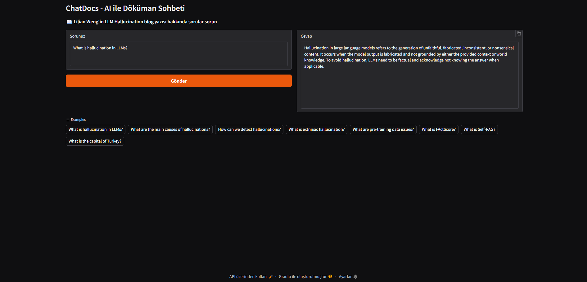
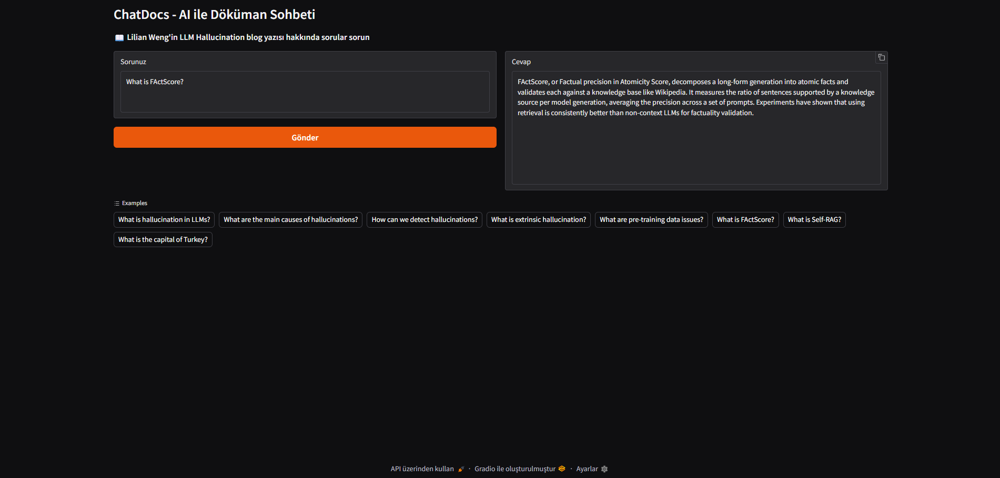
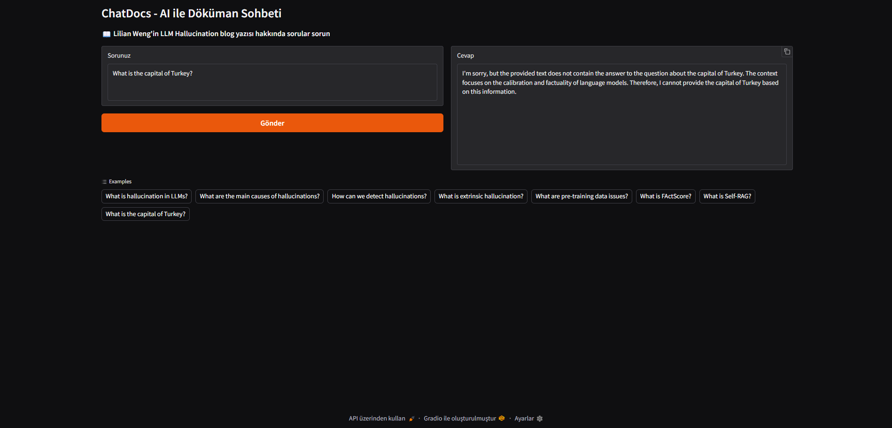

# ChatDocs

🚀 **Live Demo**: [https://chatdocs-emrevarank.streamlit.app](https://chatdocs-emrevarank.streamlit.app)

> ⚠️ Deployment sonrası yukarıdaki linki kendi Streamlit Cloud linkinizle güncelleyin!

ChatDocs is an AI-powered web application designed for intelligent question-answering from blog posts and online articles. Built with a Retrieval Augmented Generation (RAG) architecture, it helps users efficiently extract insights from web content through an intuitive chat interface.

The application addresses the challenge of quickly understanding and querying long-form content by providing instant, contextually accurate answers based on the source material.

## How It Works

**The application implements a complete RAG pipeline:**

1. **Content Extraction**: Scrapes web content using BeautifulSoup and LangChain's WebBaseLoader
2. **Intelligent Chunking**: Segments text into manageable chunks using RecursiveCharacterTextSplitter
3. **Vector Embedding**: Transforms text chunks into semantic vectors using HuggingFace's sentence-transformers (local, free)
4. **Vector Storage**: Organizes vectors in a Chroma database for efficient retrieval
5. **Context Matching**: Retrieves relevant document chunks for each query
6. **Response Generation**: Gemini 2.0 Flash-powered answer synthesis with streaming support

## Features and Use Cases

- **Web-Based Interface**: Clean, modern Gradio interface accessible from any browser
- **Real-Time Streaming**: See AI responses as they're generated, word by word
- **Example Questions**: Pre-loaded examples to help users get started quickly
- **Copy-to-Clipboard**: Easy sharing of generated answers
- **Local Embeddings**: Free, offline embeddings using HuggingFace models (no API costs)
- **Configurable LLM**: Adjust temperature, top_p, and top_k parameters for response control

**Ideal For:**
- Students researching specific topics from blog posts
- Researchers extracting insights from technical articles
- Content creators analyzing industry publications
- Anyone needing quick answers from long-form web content

## Technologies Used

- **Backend**: Python, Streamlit
- **GenAI**: Google Gemini 2.0 Flash, HuggingFace Embeddings, LangChain
- **Vector Database**: Chroma
- **Web Scraping**: BeautifulSoup4, LangChain WebBaseLoader
- **Text Processing**: RecursiveCharacterTextSplitter

## Example Results


*Question about the article content - AI provides relevant answer*


*Another relevant question - AI responds with information from the article*


*Unrelated question - AI correctly states it doesn't know*

## Current Configuration

The application is currently configured to analyze:
- **Blog Post**: [LLM Hallucination by Lilian Weng](https://lilianweng.github.io/posts/2024-07-07-hallucination/)
- **Topics Covered**: Hallucination in LLMs, detection methods, mitigation strategies, factuality vs faithfulness

## 🌐 Deploy to Streamlit Cloud (Recommended)

**Quick Steps:**
1. Push your code to GitHub
2. Go to [share.streamlit.io](https://share.streamlit.io)
3. Sign in with GitHub
4. Click **New app**
5. Select your repository: `EmreVarank/ChatDocs`
6. Main file path: `main.py`
7. Add your `GOOGLE_API_KEY` in **Advanced settings** → **Secrets**:
   ```toml
   GOOGLE_API_KEY = "your_google_api_key_here"
   ```
8. Click **Deploy**!
9. Your app will be live at: `https://APP_NAME.streamlit.app`

Detailed guide below ⬇️

## Local Installation Steps

1. Clone the repository:
   ```bash
   git clone https://github.com/EmreVarank/ChatDocs
   cd ChatDocs
   ```

2. Ensure you have Python 3.12 installed (required for compatibility):
   ```bash
   python --version  # Should show Python 3.12.x
   ```

3. Install required packages:
   ```bash
   pip install -r requirements.txt
   ```

4. Create a `.env` file and add your Google API key:
   ```
   GOOGLE_API_KEY=your_google_api_key_here
   ```

5. Run the application:
   ```bash
   streamlit run main.py
   ```

6. Open your browser - Streamlit will automatically open at `http://localhost:8501`

## Configuration

### Changing the Source URL

To analyze a different blog post or article, modify the `web_paths` parameter in `main.py`:

```python
loader = WebBaseLoader(
    web_paths=("https://your-desired-url.com",),
    bs_kwargs=dict(
        parse_only=bs4.SoupStrainer(
            class_=("post-content", "post-title", "post-header")
        )
    ),
)
```

### Adjusting LLM Parameters

Modify the LLM configuration for different response styles:

```python
llm = ChatGoogleGenerativeAI(
    model="gemini-2.0-flash-exp",
    temperature=0.7,  # Lower for more focused, higher for more creative
    top_p=0.9,        # Nucleus sampling parameter
    top_k=40,         # Top-k sampling parameter
    google_api_key=os.getenv("GOOGLE_API_KEY")
)
```

### Custom Example Questions

Update the example questions in the Streamlit app sidebar (in `main.py`):

```python
example_questions = [
    "Your question 1?",
    "Your question 2?",
    "Your question 3?",
]
```

## Project Structure

```
ChatDocs/
├── main.py                 # Main Streamlit application
├── requirements.txt        # Python dependencies
├── .env                    # Environment variables (API keys)
├── .streamlit/
│   └── secrets.toml        # Streamlit secrets (for deployment)
├── .gitignore              # Git ignore file
├── images/                 # Sample outputs
├── .vscode/                
│   └── settings.json       # VS Code Python 3.12 configuration
└── README.md               # This file
```

## Requirements

### Python Packages

- `langchain>=0.3.0` - RAG framework
- `langchain-google-genai>=2.0.0` - Gemini integration
- `langchain-community>=0.3.0` - Community integrations
- `langchain-chroma>=0.1.4` - Chroma vector store
- `google-generativeai>=0.8.5` - Google AI SDK
- `sentence-transformers>=5.0.0` - Local embeddings
- `streamlit>=1.28.0` - Web interface
- `beautifulsoup4` - Web scraping
- `python-dotenv` - Environment management

## Important Notes

- **Python Version**: This project requires Python 3.12. Python 3.13 has compatibility issues with some dependencies.
- **API Costs**: Only Gemini API calls consume quota. Embeddings run locally for free.
- **First Run**: Initial startup downloads the embedding model (~90MB) and processes the document.
- **Subsequent Runs**: Much faster as embeddings are cached in the Chroma database.

## Troubleshooting

### VS Code Using Wrong Python Version

The `.vscode/settings.json` file ensures VS Code uses Python 3.12. Don't delete it.

### Warnings on Startup

The code includes configuration to suppress most warnings. Some warnings may still appear but don't affect functionality.

### Embedding Model Download

On first run, sentence-transformers will download the model. This is normal and only happens once.

## Future Enhancements

- Multi-document support
- Chat history persistence
- Custom embedding model selection
- PDF document support
- Export conversation feature
- Multi-language support

---